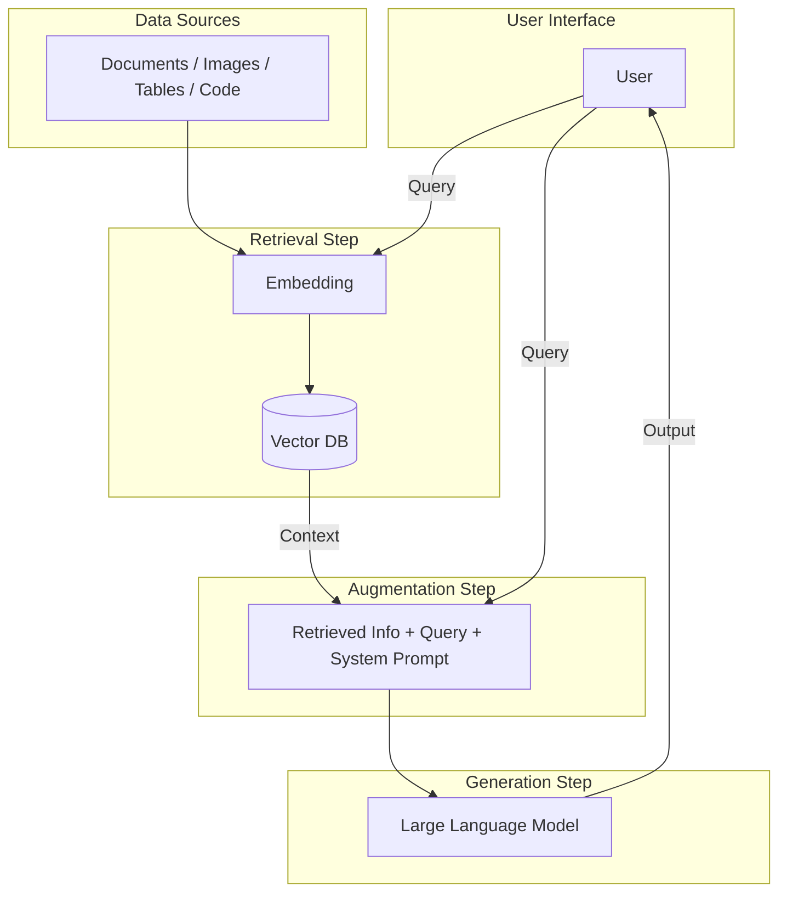
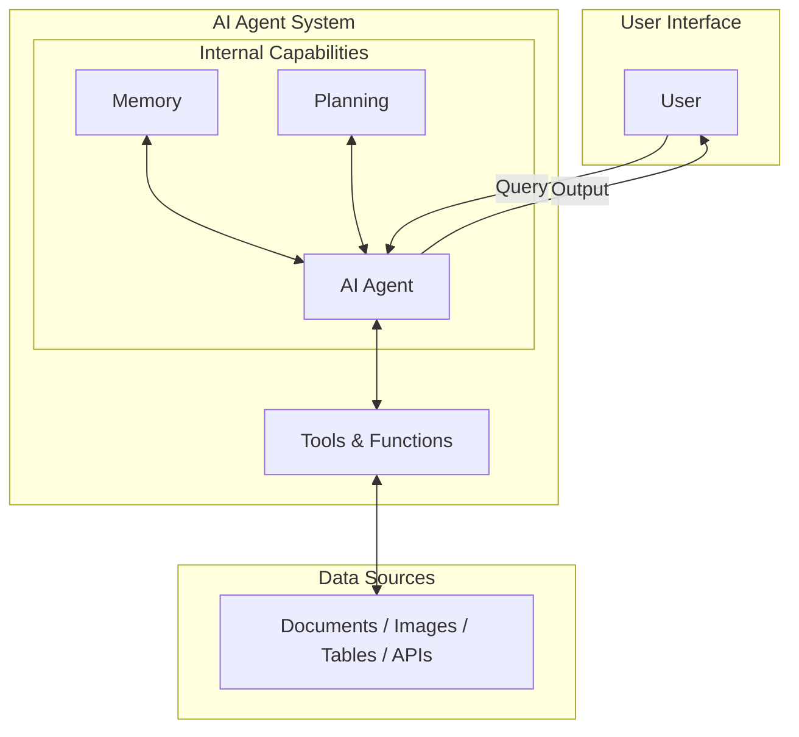
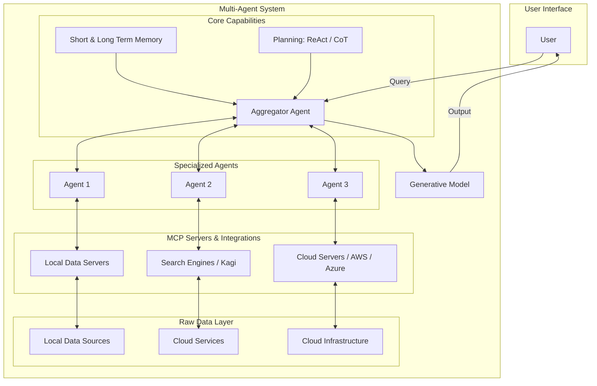

# RAG vs Agentic RAG: The Evolution of Retrieval Systems

> **Key Takeaway:** Static RAG isn't enough anymore. The next evolution is Agentic RAG, expanding capabilities from simple document lookups into multi-agent workflows capable of planning, tools utilization, and complex decision-making.

---

## 1. Traditional RAG (Static RAG)

### Description
Traditional Retrieval-Augmented Generation follows a linear, single-pass pipeline: **Retrieval $\rightarrow$ Augmentation $\rightarrow$ Generation**. 

Data sources are processed into vector embeddings and stored in a Vector DB. When a user submits a query, the system retrieves relevant chunks based on semantic similarity, combines them with a system prompt and the query, and passes the augmented context to the Large Language Model to generate an answer.

### Architecture Flow

### Use Cases
* **Internal FAQ Bots:** Answering straightforward employee questions from static HR policies or company handbooks.
* **Basic Document Q&A:** Summarizing or asking questions about single uploaded documents (e.g., PDFs, text files).

---

## 2. Agentic RAG

### Description
Agentic RAG elevates static retrieval by introducing an **AI Agent** equipped with **Memory** and **Planning** capabilities. 

Instead of executing a fixed, one-shot lookup, the Agent dynamically decides how to fulfill the request. It can iteratively reason, select appropriate specialized tools (e.g., search engines, code execution environments, or specific databases), query external data sources on demand, and refine outputs before returning the response to the user.

### Architecture Flow

### Use Cases
* **Complex Troubleshooting:** Technical support systems that need to look up documentation, test potential configurations, and query user logs before providing a solution.
* **Automated Data Analysis:** Financial or business analyst assistants that formulate a multi-step investigation plan, fetch SQL data, write visualization code, and present a final report.

---

## 3. Multi-Agent RAG

### Description
Multi-Agent RAG scales agentic systems by dividing tasks among multiple specialized agents coordinated by a central **Aggregator Agent**.

The system utilizes both **Short-Term and Long-Term Memory** alongside advanced reasoning strategies (such as **ReAct** and **Chain-of-Thought (CoT)**). The Aggregator Agent delegates sub-tasks to specialized sub-agents (e.g., Agent 1, Agent 2, Agent 3), which interact with Model Context Protocol (**MCP**) servers, local data servers, search engines (like Kagi), or cloud platforms (AWS, Azure) to solve complex workflows collaboratively.

### Architecture Flow

### Use Cases
* **Enterprise Decision Support Systems:** Cross-departmental systems that coordinate marketing analytics, financial projections, and software infrastructure data concurrently to answer executive queries.
* **Autonomous Software Engineering:** Multi-agent workflows where one agent inspects code repositories, another performs web searches for library updates, and a third runs tests on cloud instances.