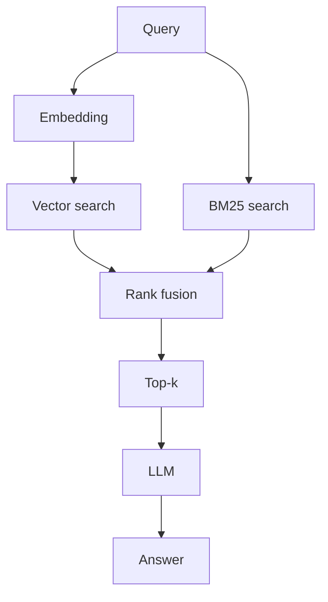
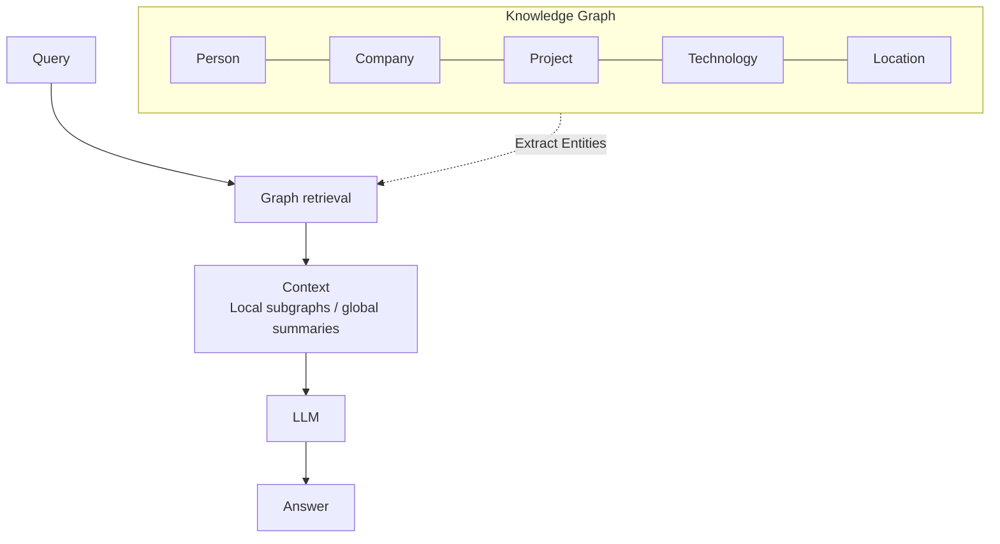
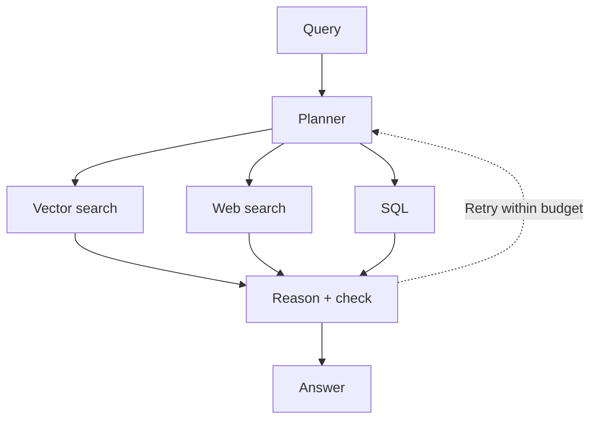
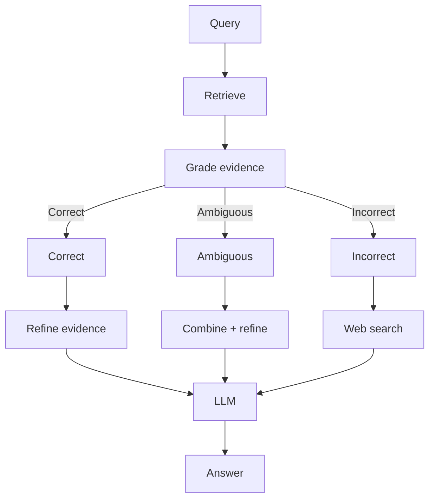
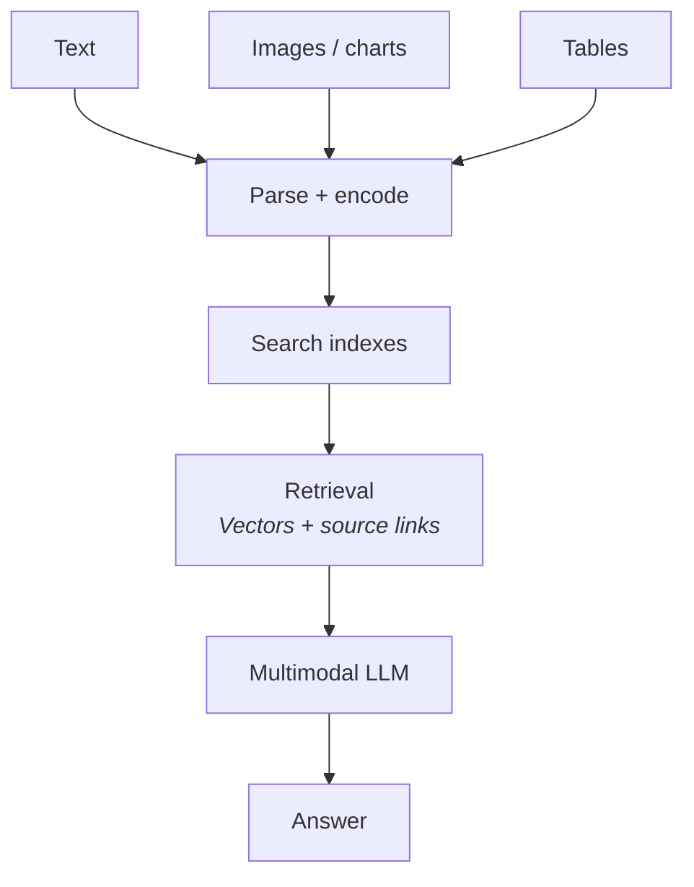

# Top 5 RAG Architectures You Must Know in 2026

## 01. Hybrid RAG

> **Core Concept:** Meaning + exact matches.

### Description

Hybrid RAG combines semantic search (vector embeddings) with traditional keyword/lexical search (like BM25). By running both retrieval mechanisms in parallel and merging their results using rank fusion algorithms (e.g., Reciprocal Rank Fusion), it captures both high-level semantic meaning and exact keyword matches.

### Architecture Flow

### Use Cases

* **E-commerce Product Search:** Searching for products where users input both semantic descriptions ("comfortable running shoes") and specific product IDs or brand names ("Nike Air Zoom Pegasus 40").

* **Legal & Medical Document Search:** Scenarios where exact terminology, statutory codes, or specific drug names must be retrieved alongside broader conceptual queries.

---

## 02. Graph RAG

> **Core Concept:** Answers in relationships.

### Description

Graph RAG builds a structured Knowledge Graph connecting entities (e.g., Person, Company, Project, Technology, Location). During query processing, it retrieves local subgraphs or global summaries based on entity relationships, enabling the LLM to understand complex, interconnected domains.

### Architecture Flow

### Use Cases

* **Enterprise Knowledge Graphs:** Mapping relationships between employees, projects, technologies, and departments to answer complex queries like *"Which projects involved both Machine Learning and Team Lead X?"*

* **Fraud Detection & Cyber Threat Analysis:** Tracing complex connections between accounts, IP addresses, and physical locations to uncover coordinated suspicious activity.

---

## 03. Agentic RAG

> **Core Concept:** Plan. Retrieve. Verify.

### Description

Agentic RAG introduces an autonomous planning agent that evaluates user requests and dynamically selects the best retrieval strategies (e.g., Vector Search, Web Search, SQL Databases). It operates within a reasoning loop that evaluates context, verifies answers, and retries queries if information is missing—all within a predefined computational budget.

### Architecture Flow

### Use Cases

* **Automated Business Intelligence & Analytics:** Questions requiring mixed data sources, such as querying an internal database for sales figures (`SQL`), searching internal docs for product context (`Vector search`), and pulling live industry news (`Web search`).

* **Customer Support & Troubleshooting Agents:** Agents that need to diagnose an issue, query manuals, check warranty databases, and iteratively gather context before delivering an answer.

---

## 04. Corrective RAG (CRAG)

> **Core Concept:** Grade before you trust.

### Description

Corrective RAG (CRAG) adds a self-evaluation step to the retrieval process. Before passing retrieved information to the LLM, a lightweight evaluator grades the relevance of the evidence:

* **Correct:** Refines the evidence to remove noise before generation.

* **Ambiguous:** Combines and refines vector context with external sources.

* **Incorrect:** Fallbacks to an external tool (e.g., Web search) to find reliable context.

### Architecture Flow

### Use Cases

* **High-Accuracy Internal Knowledge Bases:** Systems where outdated or irrelevant retrieved documents could cause severe hallucination or wrong decisions (e.g., standard operating procedures, HR policy updates).

* **Live News & Fact-Checking Systems:** Ensuring retrieved context is actually pertinent to the query, falling back to real-time web retrieval when internal indexes lack current information.

---

## 05. Multimodal RAG

> **Core Concept:** Go beyond text.

### Description

Multimodal RAG parses, embeds, and indexes heterogeneous data formats—including text, images, charts, diagrams, and structured tables. It uses multimodal LLMs (e.g., Vision Language Models) to perform joint retrieval and generation over both visual and textual content.

### Architecture Flow

### Use Cases

* **Technical Manuals & Financial Reports:** Extracting and reasoning over complex financial tables, infographics, diagrams, and circuit schematics.

* **Medical Diagnostic Support:** Combining textual patient history with visual diagnostic data (e.g., X-rays, MRI scans, pathology slides) to support clinical decision-making.